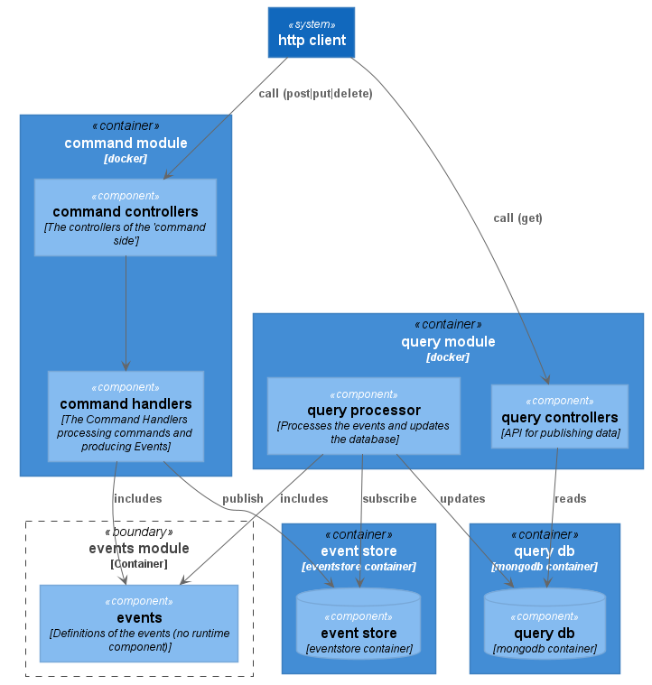

# SensRNet Backend Application

<p>
    <a href="https://github.com/kadaster-labs/sensrnet-registry-backend/actions?query=workflow%3A%22Node.js+CI%22" alt="Build status">
        
    </a>
    <a href="https://sonarcloud.io/dashboard?id=kadaster-labs_sensrnet-registry-backend" alt="Quality Gate">
        
    </a>
</p>

This is the repo for the backend component of the SensrNet application. It features a NodeJS backend, makes use of Eventstore for event sourcing, and MongoDB for storing the projection.

## Getting Started

The stack can be ran either locally, using docker with docker-compose, or deployed on a kubernetes cluster.

### Prerequisities

In order to run this application standalone, you need npm, Eventstore and MongoDB installed.

In order to run this application containerized, you'll need docker installed.

* [Windows](https://docs.docker.com/windows/started)
* [OS X](https://docs.docker.com/mac/started/)
* [Linux](https://docs.docker.com/linux/started/)

### Architecture

Module and runtime structures:



#### Modules:

- auth: Module to handle authentication.
- command:
    - Command controllers and features.
    - Command, and handlers which generate events.
- core: Event definitions, and supporting classes.
- event-store: Interface to Eventstore.
- health: Functionality to determine the application health.
- query:
  - Query processor to update the MongoDB projection.
  - Query controllers and features.
- user: Module to administrate the application users.

The runtime is defined by multiple Docker containers / `Dockerfile`s. In case of scaling up or out, the `query processor` should be put in its own container (probably stays as a single container).

### Usage

#### Standalone

Eventstore:
* Should be running. For instructions, view the [Eventstore Documentation](https://developers.eventstore.com/).

MongoDB:
* Should be running. For instructions, view the [MongoDB Documentation](https://docs.mongodb.com/manual/installation/).

Backend App:
* npm ci
* npm start

#### Containerized

Start entire stack:

```bash
$ docker-compose up --build
```

* [Registry Backend OpenAPI](http://localhost:3000/api/)
* [EventStore UI](http://localhost:2113/web/index.html#/streams)

Stop entire stack:

```bash
$ docker-compose stop
```


## Find Us

* [GitHub](https://github.com/kadaster-labs/sensrnet-home)

## Contributing

Please read [CONTRIBUTING.md](CONTRIBUTING.md) for details on our code of conduct, and the process for submitting pull requests to us.

## Maintainers <a name="maintainers"></a>

Should you have any questions or concerns, please reach out to one of the project's [Maintainers](./MAINTAINERS.md).

## License

This work is licensed under a [EUPL v1.2 license](./LICENSE.md).
