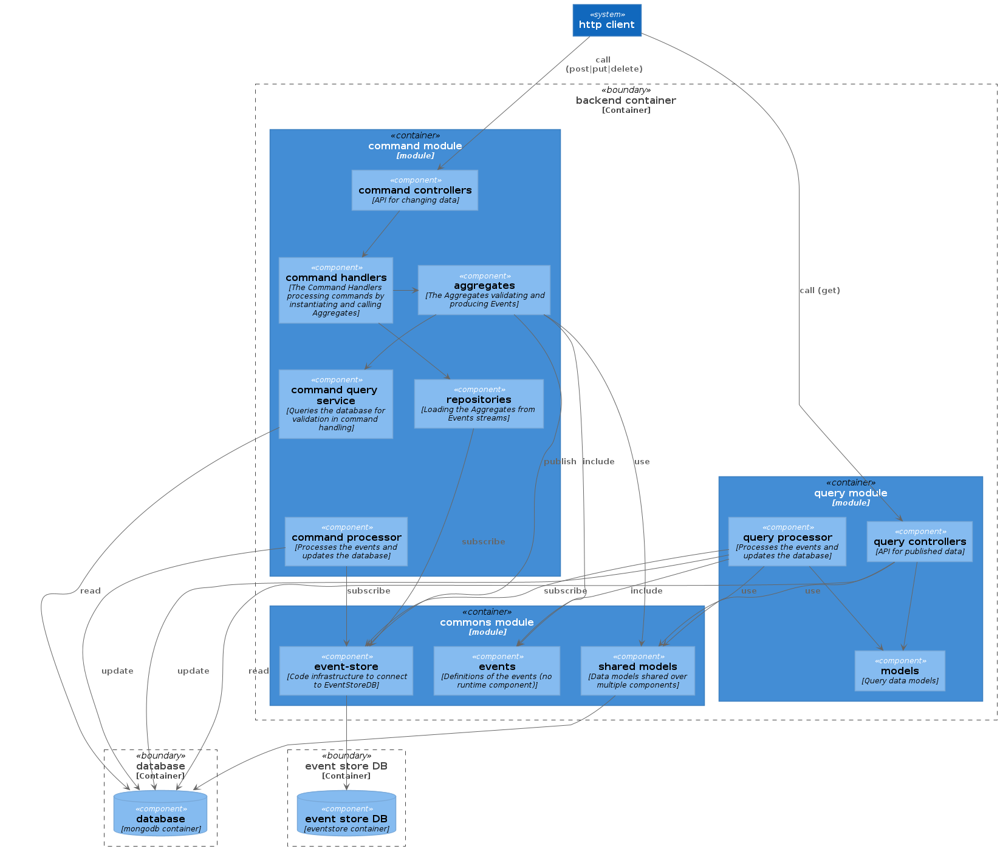

# SensrNet Backend Application

This is the backend for the SensrNet application. It features a NodeJS backend, and makes use of Eventstore.

## Getting Started

The stack can be ran locally, or using docker with docker-compose.

### Prerequisities

In order to run this application standalone, you need npm and Eventstore installed.

In order to run this application containerized, you'll need docker installed.

* [Windows](https://docs.docker.com/windows/started)
* [OS X](https://docs.docker.com/mac/started/)
* [Linux](https://docs.docker.com/linux/started/)

### Architecture

Module and runtime structures:

Modules:

- command > all command side code
- events > event definitions
- query > 
  - query processor to update the database projection
  - query controllers and query features

The runtime is defined by four Docker containers / `Dockerfile`s. In case of scaling up or out, the `query processor` should be put in its own container (probably stays as a single container).

### Usage

#### Standalone

Eventstore:
* Windows: EventStore.ClusterNode.exe --db ./db --log ./logs

Backend App:
* npm install
* npm start

#### Containerized
Entire Stack:
* docker-compose build
* docker-compose up

* [Registry Backend OpenAPI](http://localhost:3000/api/)
* [EventStore UI](http://localhost:2113/web/index.html#/streams)

## Find Us

* [GitHub](https://github.com/kad-floriw)

## Contributing

(TODO) Please read [CONTRIBUTING.md](CONTRIBUTING.md) for details on our code of conduct, and the process for submitting pull requests to us.

## Authors

* **Wim Florijn** - *Initial work* - [Kadaster](https://kadaster.nl)

See also the list of [contributors](https://github.com/your/repository/contributors) who 
participated in this project.

## License

This project is licensed under the EUPL License - see the [LICENSE.md](LICENSE.md) file for details.
